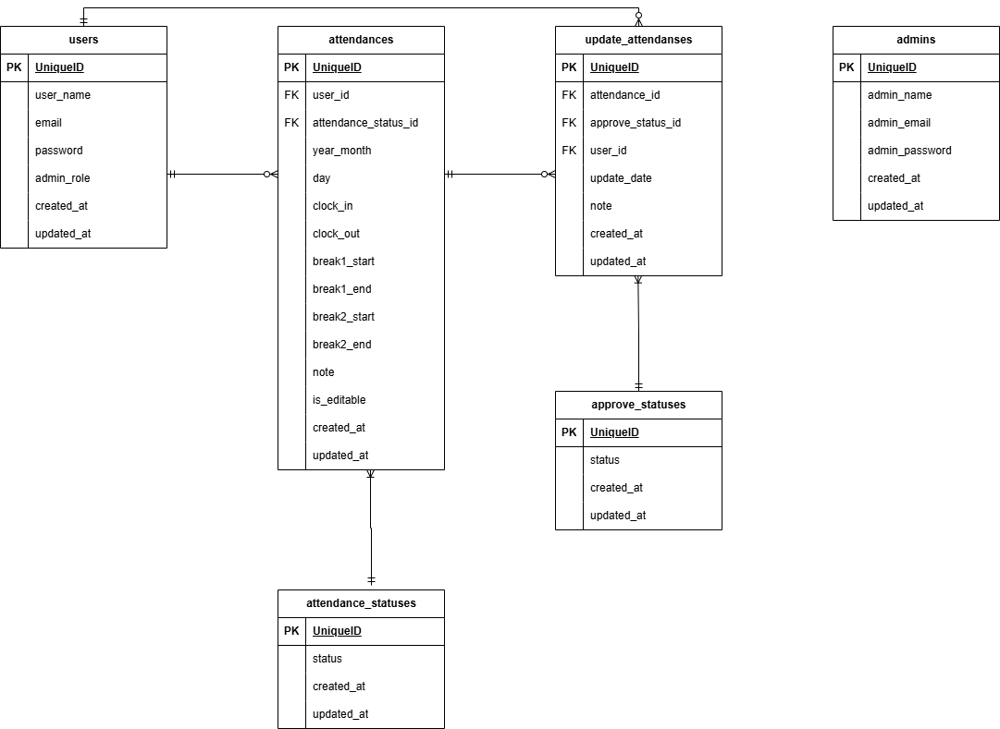

# Attendance_Management
## 環境構築
### Dockerビルド

1.　git clone git@github.com:craftbyhako/Attendance_management.git　<br>
2.　DockerDesktopアプリを立ち上げる　<br>
3.　docker-compose up -d --build　<br>
　※MacのM1・M2チップのPCの場合、no matching manifest for linux/arm64/v8 in the manifest list entriesのメッセージが表示されビルドができないことがあります。 エラーが発生する場合は、docker-compose.ymlファイルの「mysql」内に「platform」の項目を追加で記載してください　<br>

    mysql:
        platform: linux/x86_64(この文追加)
        image: mysql:8.0.26
        environment:


### Laravel環境構築

1.　docker-compose exec php bash　<br>
2.　composer install　<br>
3.「.env.example」ファイルを 「.env」ファイルに命名を変更。または、新しく.envファイルを作成　<br>
4.　.envに以下の環境変数を追加 <br>
```
        DB_CONNECTION=mysql
        DB_HOST=mysql
        DB_PORT=3306
        DB_DATABASE=laravel_db
        DB_USERNAME=laravel_user
        DB_PASSWORD=laravel_pass
```
5.アプリケーションキーの作成　<br>
    php artisan key:generate　<br>
6.マイグレーションの実行　<br>
    php artisan migrate　<br>
7.シーディングの実行　<br>
    php artisan db:seed　<br>

## 使用技術(実行環境)
PHP8.3.6　<br>
Laravel8.83.8　<br>
MySQL8.0.26　<br>


## URL
開発環境：http://localhost/　<br>
phpMyAdmin:：http://localhost:8080/　<br>


## テーブル仕様
### usersテーブル
| カラム名 | 型 | primary key | unique key | not null | foreign key |
| --- | --- | --- | --- | --- | --- |
| id | bigint |	〇 |  | 〇 |  |
| user_name | varchar(255) |  |  | 〇 |  |
| email |  varchar(255) |	 | 〇 | 〇 |  |
| email_verified_at | timestamp |	 |  |  |  |
| password | varchar(255) |	 |  | 〇 |  |
| two_factor_secret | text |	 |  |  |  |
| two_factor_recovery_codes | text |	 |  |  |  |
| two_factor_confirmed_at | timestamp |	 |  |  |  |
| admin_role | int |	 |  |  |  |
| remember_token | varchar(100) |	 |  |  |  |
| created_at | timestamp |	 |  |  |  |
| updated_at | timestamp |	 |  |  |  |

### attendancesテーブル
| カラム名 | 型 | primary key | unique key | not null | foreign key |
| --- | --- | --- | --- | --- | --- |
| id | bigint	| 〇 |  | 〇 |  |	
|	user_id | bigint |  |  | 〇 | 〇 |		
| attendance_status_id | bigint |  |  | 〇 | 〇 |	
| year_month | varchar(255)	|  |  | 〇 |  |	
| day	| varchar(255) |  |  | 〇 |  |	
| clock_in | time |  |  | 〇 |  |			
| clock_out |	time |  |  |  |  |		
| break1_start | time |  |  |  |  |			
|	break1_end | time |  |  |  |  |			
| break2_start | time |  |  |  |  |			
| break2_end | time |  |  |  |  |			
| note | varchar(255) |  |  |  |  | 	
|	created_at | timestamp |  |  |  |  |			
|	updated_at | timestamp |  |  |  |  |			
| is_editable | tinyint(1) |  |  | 〇 |  |	
	

### attendance_statusesテーブル
| カラム名 | 型 | primary key | unique key | not null | foreign key |
| --- | --- | --- | --- | --- | --- |
| id | bigint	| 〇 |  | 〇 |  |	
| status | varchar(255) |  |  | 〇 |  |
|	created_at | timestamp |  |  |  |  |			
|	updated_at | timestamp |  |  |  |  |		


### approve_statusesテーブル
| カラム名 | 型 | primary key | unique key | not null | foreign key |
| --- | --- | --- | --- | --- | --- |
| id | bigint	| 〇 |  | 〇 |  |	
| status | varchar(255) |  |  | 〇 |  |
|	created_at | timestamp |  |  |  |  |			
|	updated_at | timestamp |  |  |  |  |		


### updated_attendancesテーブル
| カラム名 | 型 | primary key | unique key | not null | foreign key |
| --- | --- | --- | --- | --- | --- |
| id | bigint	| 〇 |  | 〇 |  |	
| user_id | bigint |  |  | 〇 | 〇 |			
| attendance_id | bigint |  |  | 〇 | 〇 |	
| approve_status_id |	bigint |  |  | 〇 | 〇 |		
| update_date	| date |  |  | 〇 |  |		
| note | text |  |  | 〇 |  |
|	created_at | timestamp |  |  |  |  |			
|	updated_at | timestamp |  |  |  |  |	


## ER図



## テストアカウント
name: test1  
email: test@example.com1  
password: password  
※主なテストユーザー
-------------------------
name: test2  
email: test@example.com2  
password: password  
-------------------------
name: adm1  
email: adm@example.com  
password: password  
※管理者
-------------------------

## PHPUnitを利用したテストに関して
- テスト用データベースを作成しておく。
```
docker-compose exec mysql bash
mysql -u root -p (パスワードはrootと入力)
create database test_database;
```

- .env.testing` にテスト用 DB の情報を設定しておく。
#### 例: `.env.testing`
```
DB_CONNECTION=mysql
DB_HOST=mysql
DB_PORT=3306
DB_DATABASE=test_database
DB_USERNAME=laravel_user
DB_PASSWORD=laravel_pass
```

- コンテナ内の PHP に入り、マイグレーション・シーディング実行。
```
docker-compose exec php bash
php artisan migrate:fresh --env=testing
php artisan db:seed --env=testing
```
- テストの実行。
```
php artisan test または ./vendor/bin/phpunit

特定テストのみ実行する場合:
php artisan test --filter=LoginTest
```  


[def]: ER_attendance_management.png
[def2]: ER_attendance_management.png